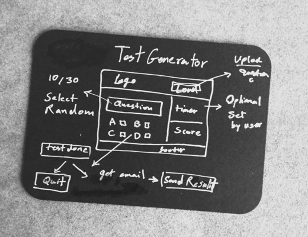

# Project Idea
## Test Generator

## Requirements
* Upload Test Questions
* Generate 10 Random Question
* Option to set the timer
* Option to quit/reset
* Process and score the questioner 
* Option to email the result 
 

## JavaScript / Interactive web page
## Commit rules
* CA   > Code Added
* CE   > Code Edited
* CF   > Code Fixed
* DT   > Developer Test
* DI   > Integration Test (N/A)
* UT   > User Test
* MD   > documentaion notes

### Notes for documentation
* using GRID Layout to maintain responsivity

### Fixes
* 404 page not working
* adjust contact form margins/padding relative to the grid structure